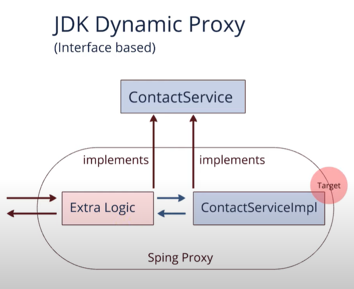

# Spring Transaction  

Проект по теме: @Transaction  

Материалы взяты с youtube.com JavaGuru
---
## Уровни изолированности транзакций

## Способы управления транзакциями
1. @Transaction
2. TransactionTemplate
3. TransactionManager
4. tx:advice

## Запустить приложение
Открыть браузер
```http request
http://localhost:8089/swagger-ui/index.html
```
Request body
```json
{
  "senderId": "Tom",
  "recipientId": "Anna",
  "amount": 1000
}
```
## H2 - profiles dev
```http request
http://localhost:8089/h2-console
```


## Postgres - profiles prod
```bash
docker run --name transactionsDB -p 5434:5432 -e POSTGRES_USER=postgres -e POSTGRES_PASSWORD=postgres -e 
POSTGRES_DB=postgres -v c:\postgresdocker:/var/lib/postgresql/data --restart=unless-stopped postgres:16
```

## Proxy
  


```java
public class TransactionAutoConfiguration
//-------CglibProxy
@Configuration(
        proxyBeanMethods = false
)
@EnableTransactionManagement(
        proxyTargetClass = true
)
@ConditionalOnProperty(
        prefix = "spring.aop",
        name = {"proxy-target-class"},
        havingValue = "true",
        matchIfMissing = true
)
public static class CglibAutoProxyConfiguration {
    public CglibAutoProxyConfiguration() {
    }
}
// --------DynamicProxy
@Configuration(
        proxyBeanMethods = false
)
@EnableTransactionManagement(
        proxyTargetClass = false
)
@ConditionalOnProperty(
        prefix = "spring.aop",
        name = {"proxy-target-class"},
        havingValue = "false"
)
public static class JdkDynamicAutoProxyConfiguration {
    public JdkDynamicAutoProxyConfiguration() {
    }
}
```

### Прочее
метод rollbackOn в DefaultTransactionAttribute
```java
    public boolean rollbackOn(Throwable ex) {
        return ex instanceof RuntimeException || ex instanceof Error;
    }
```
