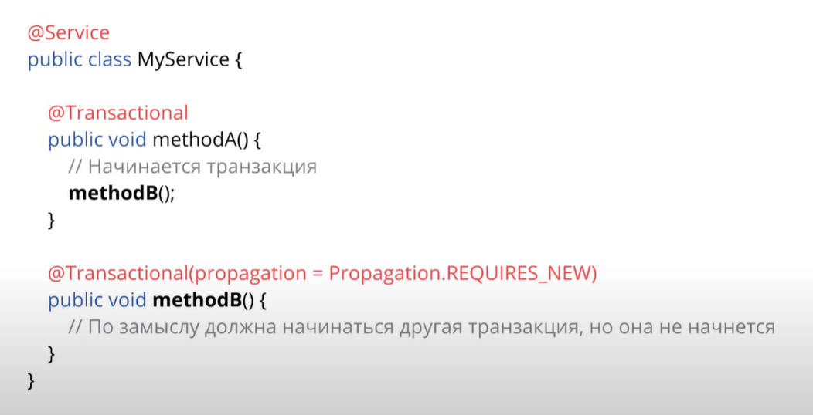
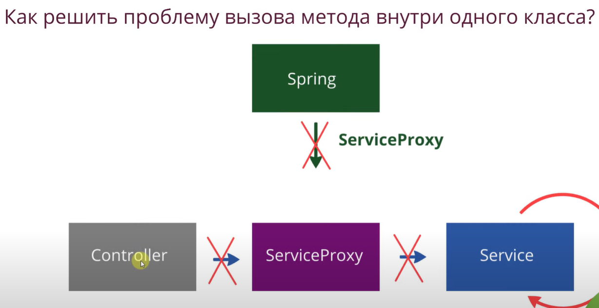
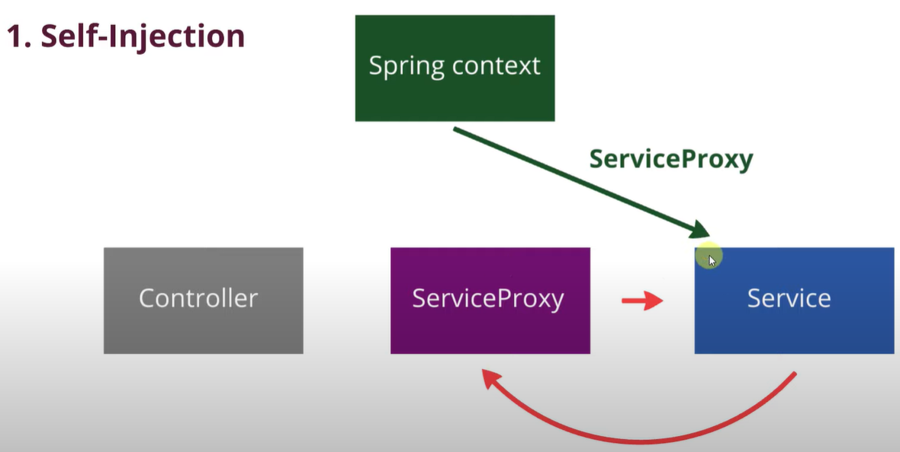
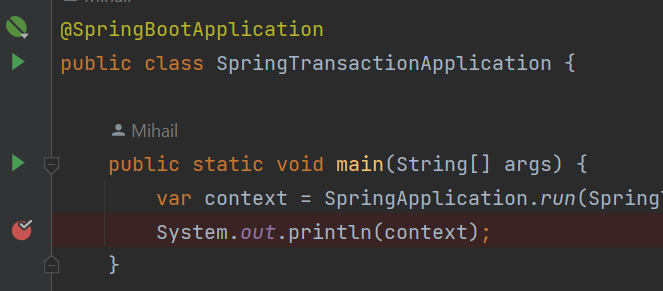
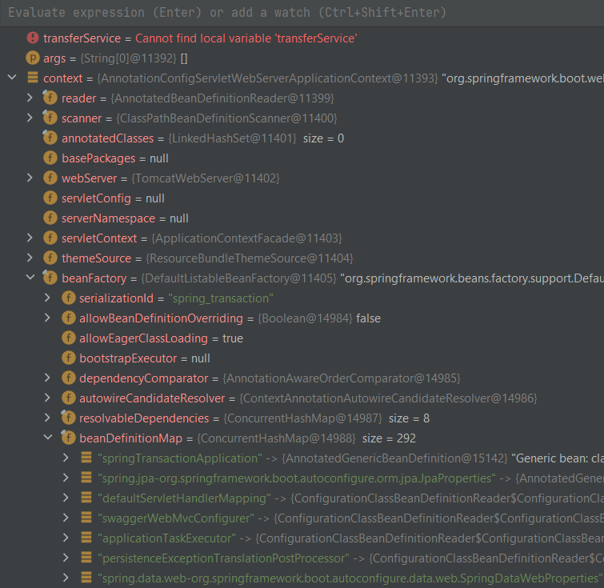
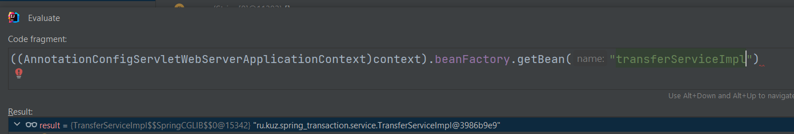
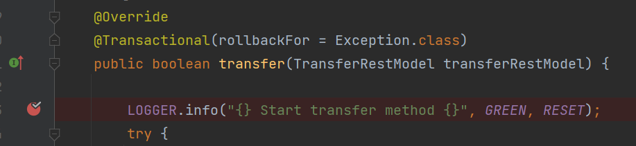
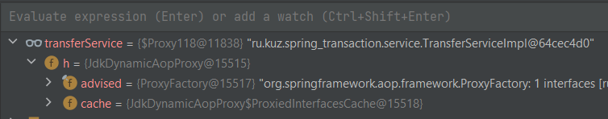
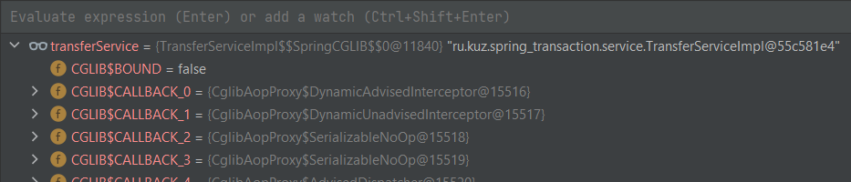

#

## Почему новая транзакция не откроется?
Из контроллера вызывается methodA()


Новая транзакция не будет открыта.
Сервис вызывает самого себя по своей ссылке.


Решить можно с помощью Self-injection

Решить можно через Setter.
```java
    private TransferService transferService;

    public TransferServiceImpl(TransferRepository transferRepository) {
        this.transferRepository = transferRepository;
    }

    // Внедрение через сеттер (Spring автоматически вызовет его)
    @Autowired
    public void setTransferService(@Lazy TransferService transferService) {
        this.transferService = transferService;
    }
```
Решить можно через PostConstruct.

## Проверка
Посмотреть количество в терминале:
```text
Initiating transaction commit
```

## Узнаем какой прокси выполняется при иньекции

устанавливаем точку остановы  
  
запускаем в debug  
  
нажимаем Alt+F8 на поле beanDefinitionMap  
  
Получаем наш объект TransferServiceImpl, не прокси.
```text
ru.kuz.spring_transaction.service.TransferServiceImpl@3986b9e9
```
Закроем окна.  
А теперь поставим точку остановы в `class TransferServiceImpl` на:
  
и сделаем запрос из браузера. Мы остановились на точке.
Поместим наш transferService в отслеживаемые переменные (ПКМ, `+Add to Watches`).


И видим что у нас прокси `DynamicAopProxy`, потому что он более легковесный, если у нас есть интерфейс.
#### Когда делаем через инъекцию или через сеттер - у нас создается DynamicAopProxy. 
***
Если бы у нас не было интерфейса TransferService, то было бы так:

  
И видим что у нас прокси `SpringCglib`  

